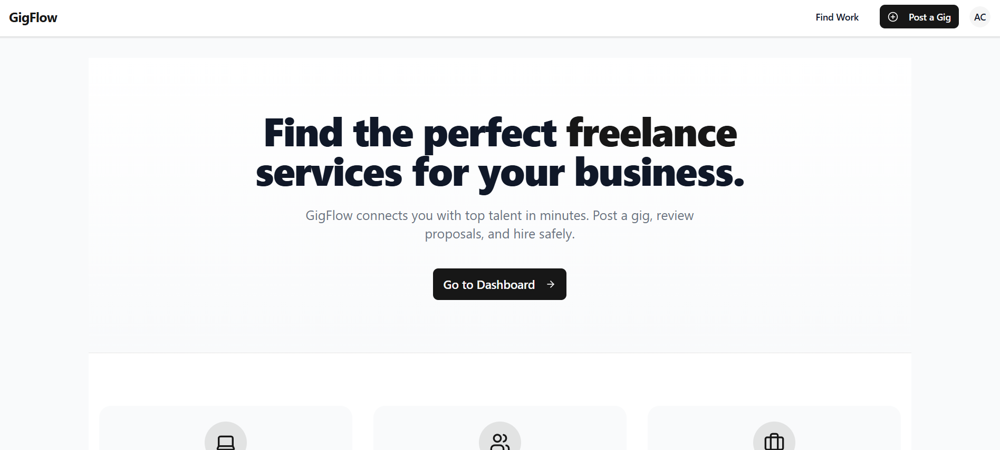
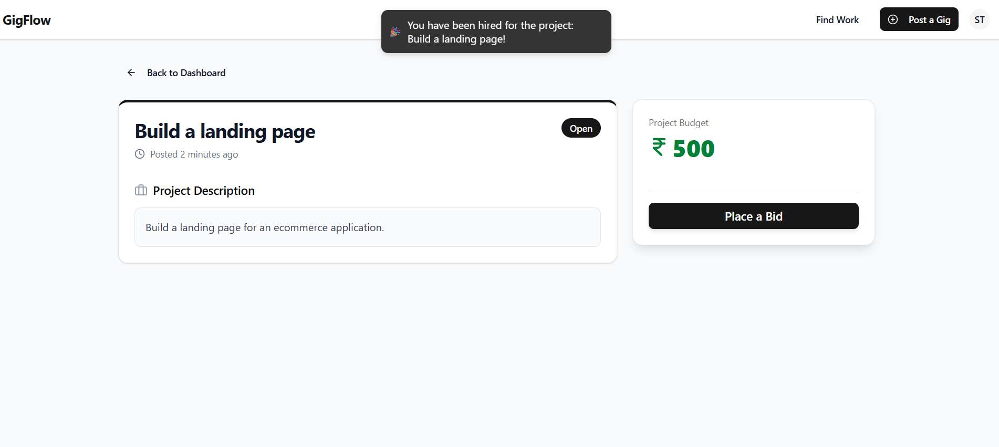
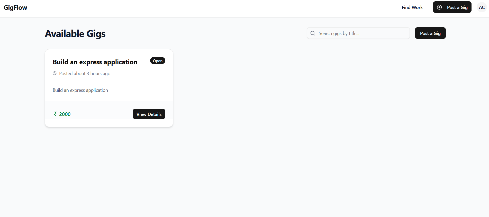
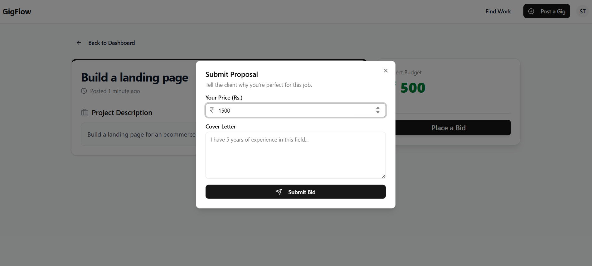
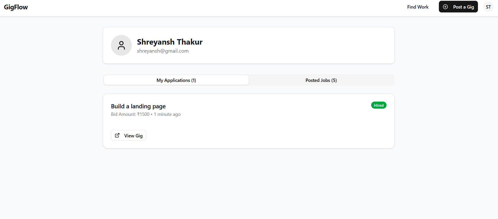
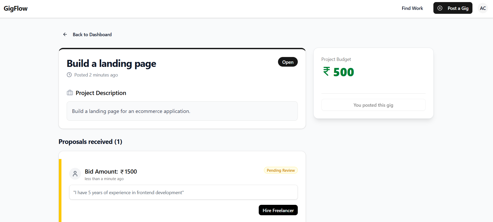

# GigFlow 🚀

A real-time, full-stack freelance marketplace built for performance and reliability.

## 🎥 Demo Video

[](https://youtu.be/tN9O6Nj8xrU)

> A complete walkthrough showcasing real-time hiring, WebSocket notifications, and secure authentication.

## 🖼️ Screenshots

### Landing


### Real-Time Hire Notification


### Available Gigs


### Bid


### Profile


### Hiring


---

## 📋 Overview

**GigFlow** is a production-grade platform connecting **Freelancers** and **Clients**.  
Unlike standard CRUD apps, it is engineered to handle **concurrency** and **real-time state synchronization**.

It features **Atomic Database Transactions** to prevent race conditions during the hiring process and uses **WebSockets** for instant **"Hired" notifications** without polling.

---

## ⚡ Key Features (The "Hard" Stuff)

### ⚛️ Atomic Hiring Transactions
Implemented MongoDB **ACID transactions** to ensure that when a freelancer is hired:
- The gig status updates
- Other bids are rejected simultaneously  

If any step fails, the entire operation **rolls back**.

---

### 🔌 Real-Time WebSockets
Integrated **Socket.io** to push notifications instantly.  
When a client clicks **"Hire"**, the freelancer receives a **toast notification** immediately.

---

### 🛡️ Secure Authentication
Uses **HttpOnly Cookies** with a **Vercel Rewrite Proxy** to handle secure cross-domain authentication between **Vercel** and **Render**.

---

### 🐳 Fully Dockerized
Includes a `docker-compose.yml` for a **one-click local development environment**:
- Frontend  
- Backend  
- MongoDB Replica Set  

---

## 🛠️ Tech Stack

| Domain | Technologies |
|------|-------------|
| **Frontend** | React (Vite), TypeScript, Tailwind CSS, ShadCN/UI, Axios |
| **Backend** | Node.js, Express, TypeScript, Socket.io |
| **Database** | MongoDB Atlas (Replica Set enabled for Transactions) |
| **DevOps** | Docker, Docker Compose, Render (Backend), Vercel (Frontend) |

---

## 🚀 Getting Started (Local Development)

> **Note:**  
> The `main` branch is optimized for the **Live Production environment (HTTPS/Cookies)**.  
> For the best **Local Development experience (Docker/HTTP)**, please use the `local-docker` branch.

---

### Option 1: Docker (Recommended)

#### Clone the repository
```bash
git clone https://github.com/Shreyansh-32/GigFlow.git
cd gigflow
```

### Switch to the Local-Stable branch
```bash
git checkout local-docker
```

### Run with docker compose
```bash
git checkout local-docker
```

### Access the App
- **Frontend:** http://localhost:5173  
- **Backend:** http://localhost:8000  

---

## Option 2: View Production Code

To view the latest deployed code used in the Live Demo:

```bash
git checkout main
```

## 🔑 Environment Variables

See `.env.example` for the complete list.

---

### Server (`server/.env`)
```env
PORT=8000
MONGO_URI=mongodb+srv://...
JWT_SECRET=your_secret_key
NODE_ENV=development
FRONTEND_URL=http://localhost:5173
```
### Frontend(`frontend/.env`)
```env
VITE_BACKEND_URL=/api
# Note: set to "/api" to use the Vercel Proxy in production,
# or full URL (http://localhost:8000/api) for manual local dev
```
